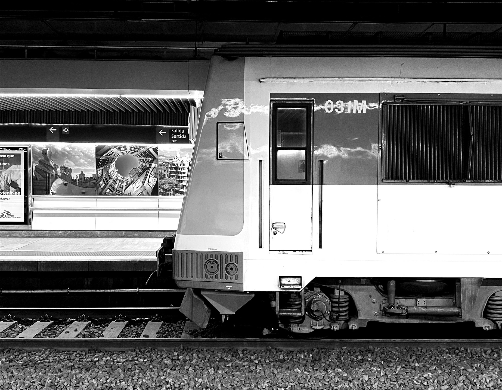

I wrote this guide to provide a friendly approach to the public transport system in Barcelona. If you have some experience in using public transport around the globe, you’ll find that Barcelona’s system isn’t very different from other large cities like Paris, Milan, or Berlin. However, if it’s your first time giving public transport a go, then you might want to take your time and read the complete guide.

There are multiple guides offering a simple approach to the Barcelona public transport. And, to be honest, most of the information contained here is not strictly necessary if you just want to hop in and out of a bus a couple of times during your stay in Barcelona. However, this guide is for you if:

* You are going to stay in Barcelona for a while and you’re not familiar with its public transport.
* You like being in control and anticipating every single detail of your trip.
* You’re just a fan of public transport.

## Introduction 

It’s great news that you’re considering public transport as a way to move around the city. You’re doing a favour to yourself and to others, and you’ll see this is a rewarding way to get to know the city and integrate amongst the locals, which many would identify as the true difference between being a tourist and being a traveller. As a local, I want to thank you for considering a sustainable mean of transport and taking care of our city.

Public transport in Barcelona is good, cheap, (relatively) clean and safe (be aware of non-violent pickpocketers and how to avoid them). However, not all the efforts have been made to make it simple. It can sometimes be confusing, particularly for newcomers or visitors who are not used to massive transportation. If this is your case, there is something you should know: almost everyone uses public transport in Barcelona. The young and the old, the poor and the rich, men and women, straight and gay, black or white. It is a place of huge diversity (of which locals are proud) and it proves that everyone, regardless of their condition, has the need to move.

Please, be considerate to others when you use public transport. Follow the local guidelines and always act according to a golden, often-forgotten rule: don’t do anything that can be annoying to others. It is also considered very appropriate to give your seat to elders, pregnant women or, in general, anyone who might struggle to stand up in a constantly accelerating vehicle, especially if you’re fit and healthy.

Having said so, let’s get started.

### Types of transport

The Barcelona Public Transport System has multiple layers, some of them underground, some others running at street level. In general, we can define *5 means of transportation*:
* Trains
* Metro
* Buses

### A foreword about fare integration

Before 2001, there were many public transport operators running in Barcelona, and users had to ensure they would have a valid ticket for each and single one of them. However, things have changed for the good: now, public transport is fare-integrated. This means that you, as a customer, can buy an integrated ticket and travel in any form of public transport you like, the fare will be the same. The price of the ticket changes depending on how far you want to travel, but the whole city of Barcelona is within Zone 1, so 1-zone tickets are fine for most tourists.

There are still different operators running different lines, and they still offer you their non-integrated tickets (like the rather expensive single ticket, which you should generally avoid). You, however, should always aim for integrated tickets (they’re green, and they look like this). Read more about integration here.

## Trains 
There are three different type of trains running under the streets of Barcelona.

TMB Metro trains. TMB is the “traditional” metro operator, and it operates most of the lines in the network. All metro services call at all stations, and there are no express services.

FGC metro and suburban trains. FGC is the Catalan government rail operator, and it operates two lines starting from Plaça Catalunya and Plaça Espanya. Within Barcelona, FGC operates similarly to a metro service, due to the small spacing between stations. However, be aware that some services are semi-direct and do not call at every station.

* TMB Metro trains. TMB is the “traditional” metro operator, and it operates most of the lines in the network. All metro services call at all stations, and there are no express services.

* FGC metro and suburban trains. FGC is the Catalan government rail operator, and it operates two lines starting from Plaça Catalunya and Plaça Espanya. Within Barcelona, FGC operates similarly to a metro service, due to the small spacing between stations. However, be aware that some services are semi-direct and do not call at every station.

